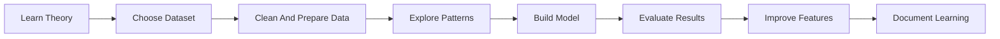
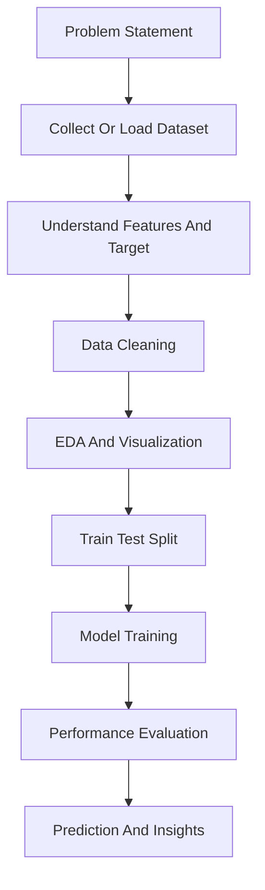
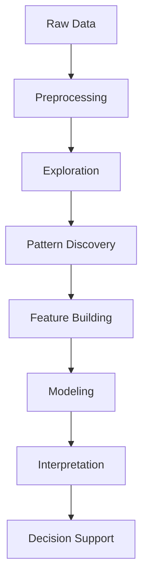

# Data Analytics Journey

<h1 align="center">Hi, I'm Joshit</h1>

  Aspiring Data Analyst and Machine Learning learner building practical projects with Python, data analysis, visualization, and predictive modeling.

  <a href="https://github.com/Joshit-innit/DataAnalystics_journey">Repository</a>

---

## Profile

This repository represents my hands-on learning journey in **Data Analytics**, **Machine Learning**, and **problem solving with real datasets**.  
I use notebook-based projects to understand how data moves from raw input to cleaned features, trained models, evaluated results, and final insights.

My work here focuses on:

- Exploratory Data Analysis
- Data Cleaning and Preprocessing
- Classification and Regression
- Clustering and Segmentation
- Prediction Systems
- Model Evaluation
- Insight-driven storytelling with data

---

## My Goal

My goal is to grow into a strong **Data Analyst / Machine Learning Engineer** who can:

- understand business and real-world problems through data
- clean and prepare datasets effectively
- build reliable machine learning models
- visualize patterns and explain insights clearly
- convert data into meaningful predictions and decisions

I want this repository to reflect steady progress, practical learning, and project-based improvement over time.

---

## Tech Stack And Libraries

  
  &nbsp;&nbsp;
  
  &nbsp;&nbsp;
  
  &nbsp;&nbsp;
  
  &nbsp;&nbsp;
  

### Libraries And Tools Used

- Python
- Pandas
- NumPy
- Matplotlib
- Scikit-learn
- Jupyter Notebook
- Data Visualization
- EDA
- Feature Engineering
- Model Evaluation
- Predictive Modeling

---

## What I Have Learned So Far

### Data Analytics

- reading and understanding structured datasets
- cleaning data and handling missing values
- analyzing distributions, trends, and outliers
- extracting useful patterns from raw data
- presenting insights with visualizations

### Machine Learning

- supervised learning workflows
- regression and classification problems
- model fitting, testing, and evaluation
- feature engineering and preprocessing
- building prediction systems on domain datasets

### Project Skills

- end-to-end notebook development
- comparing multiple datasets and problem statements
- translating learning concepts into mini projects
- improving logic through experimentation and iteration

---

## Current Project Portfolio

| No. | Project | Domain | Link |
| --- | --- | --- | --- |
| 1 | Autism Prediction Machine Learning | Healthcare / Classification | [Open Notebook](./AutismPredictionMachineLearning.ipynb) |
| 2 | Breast Cancer Detection Machine Learning | Healthcare / Classification | [Open Notebook](./BreastCancerDetectionMachineLearning.ipynb) |
| 3 | Customer Churn Machine Learning | Business / Classification | [Open Notebook](./CustomerChurnMachineLearning.ipynb) |
| 4 | Customer Segmentation KMeans | Clustering / Segmentation | [Open Notebook](./CustomerSegmentationKMeans.ipynb) |
| 5 | Fraud Detection Machine Learning | Fraud Detection / Classification | [Open Notebook](./FraudDetectionMachineLearning.ipynb) |
| 6 | Insurance Machine Learning | Insurance / Regression | [Open Notebook](./InsuranceMachineLearning.ipynb) |
| 7 | Linear Regressions | Regression Fundamentals | [Open Notebook](./LinearRegressions.ipynb) |
| 8 | Movie Recommendation Machine Learning | Recommendation Systems | [Open Notebook](./MovieRecommendationMachinelearning.ipynb) |
| 9 | Rain Fall Prediction Machine Learning | Weather / Prediction | [Open Notebook](./RainFallPredictionMachineLearning.ipynb) |
| 10 | Spam Mail Detection Machine Learning | NLP / Classification | [Open Notebook](./SpamMailDetectionMachineLearning.ipynb) |
| 11 | Titanic Survival Machine Learning | Classification | [Open Notebook](./TitanicSurvivalMachineLearning.ipynb) |
| 12 | BigMart Sales Machine Learning | Retail / Sales Prediction | [Open Notebook](./projects/BigMartSalesMachineLearning.ipynb) |
| 13 | Car Price Prediction Machine Learning | Regression | [Open Notebook](./projects/CarPricePrdictionMachineLearning.ipynb) |
| 14 | Diabeties Detection Machine Learning | Healthcare / Classification | [Open Notebook](./projects/DiabetiesDetectionMachineLearning.ipynb) |
| 15 | Gold Price Prediction Machine Learning | Finance / Regression | [Open Notebook](./projects/GoldPricePredictionMachineLearning.ipynb) |
| 16 | Heart Disease Prediction Machine Learning | Healthcare / Classification | [Open Notebook](./projects/HeartDiseasePredictionMachineLearning.ipynb) |
| 17 | Mine Prediction Machine Learning | Sonar / Classification | [Open Notebook](./projects/MinePredictionMachineLearning.ipynb) |
| 18 | Wine Testing Machine Learning | Classification / Quality Analysis | [Open Notebook](./projects/WineTestingMachineLearning.ipynb) |

---

## Learning Roadmap In Action

---

## Project Development Flow

---

## My Analytics Mindset

---

## What This Repository Shows

- practical use of Python for data analysis
- growing confidence with machine learning concepts
- project-based learning across multiple domains
- consistent work on classification, regression, clustering, and prediction tasks
- real progress from foundational notebooks to broader applied projects

---

## What I Am Learning Next

- SQL for data analysis
- dashboarding with Power BI or Tableau
- stronger feature engineering techniques
- model tuning and optimization
- deployment of machine learning projects
- deeper work in recommendation systems and NLP

---

## Explore The Repository

If you want to view all my projects and track my learning journey, visit:

[Joshit-innit/DataAnalystics_journey](https://github.com/Joshit-innit/DataAnalystics_journey)

---

  Built through curiosity, consistency, and continuous learning with data.

