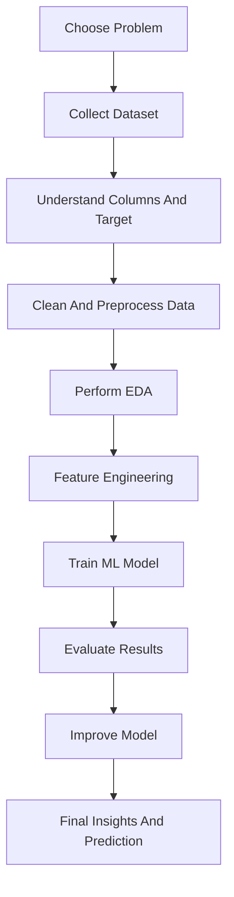
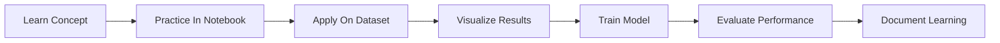
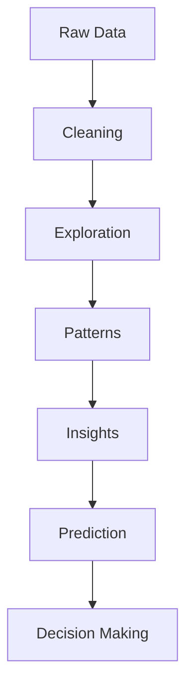

# Data Analytics Journey

<h1 align="center">Hi, I'm Joshit</h1>

  Aspiring Data Analyst and Machine Learning enthusiast focused on turning raw data into useful insights, predictions, and better decisions.

  <a href="https://github.com/Joshit-innit/DataAnalystics_journey">Repository Link</a>

---

## Profile

I am building my journey in **Data Analytics**, **Machine Learning**, and **Python-based problem solving** by working on real datasets and end-to-end mini projects.
This repository reflects my learning process through hands-on notebooks covering:

- Exploratory Data Analysis
- Data Cleaning and Preprocessing
- Classification
- Regression
- Clustering
- Healthcare Analytics
- Retail and Sales Prediction
- Fraud Detection

---

## My Goal

My goal is to become a strong **Data Analyst / Data Scientist** who can:

- understand real-world data problems
- clean and transform messy datasets
- visualize patterns clearly
- build machine learning models
- explain insights in a simple and practical way

I want to keep improving in analytics, model building, and project presentation so I can solve business and real-life problems with data.

---

## Tech Stack And Libraries

  
  &nbsp;&nbsp;
  
  &nbsp;&nbsp;
  
  &nbsp;&nbsp;
  
  &nbsp;&nbsp;
  

### Libraries and Tools I've Used

- Python
- Pandas
- NumPy
- Matplotlib
- Scikit-learn
- Jupyter Notebook
- Data Visualization
- Exploratory Data Analysis
- Feature Engineering
- Machine Learning Models

---

## What I Have Learned So Far

### Data Analytics

- Data collection and dataset understanding
- Data cleaning and preprocessing
- Handling missing values
- Exploratory Data Analysis
- Pattern finding and insight extraction
- Data visualization for storytelling

### Machine Learning

- Supervised learning
- Classification models
- Regression models
- Model training and evaluation
- Feature engineering
- Prediction pipelines

### Project Skills

- Working with real datasets
- Notebook-based experimentation
- Comparing multiple approaches
- Organizing ML workflows from raw data to final result

---

## Projects In This Repository

| No. | Project Name | Area | File Link |
| --- | --- | --- | --- |
| 1 | Customer Segmentation KMeans | Clustering / Segmentation | [Open Notebook](./CustomerSegmentationKMeans.ipynb) |
| 2 | Insurance Machine Learning | Prediction / Regression | [Open Notebook](./InsuranceMachineLearning.ipynb) |
| 3 | Titanic Survival Machine Learning | Classification | [Open Notebook](./TitanicSurvivalMachineLearning.ipynb) |
| 4 | Fraud Detection Machine Learning | Fraud Detection / Classification | [Open Notebook](./frauddetectionmachinelearning.ipynb) |
| 5 | BigMart Sales Machine Learning | Sales Prediction | [Open Notebook](./projects/BigMartSalesMachineLearning.ipynb) |
| 6 | Heart Disease Analysis | Healthcare Analytics | [Open Notebook](./projects/HeartDiseaseAnalysis.ipynb) |
| 7 | Wine Testing | Classification / Analysis | [Open Notebook](./projects/WineTesting.ipynb) |
| 8 | Car Price Predictions | Regression | [Open Notebook](./projects/carPricePrdictions.ipynb) |
| 9 | Diabetes Detection | Healthcare / Classification | [Open Notebook](./projects/diabetiesDetection_EXP2.ipynb) |
| 10 | Gold Prediction | Prediction / Regression | [Open Notebook](./projects/gold_prediction.ipynb) |
| 11 | Rock vs Mine | Classification | [Open Notebook](./projects/rockVSmine_EXP1.ipynb) |

---

## Project Development Flow

---

## My Learning Workflow

---

## Data Analytics Mindset

---

## Repository Highlights

This repository shows my progress in:

- analytics thinking
- machine learning practice
- project-based learning
- working with classification, regression, and clustering problems
- building confidence with Python libraries used in data science

---

## Future Learning Goals

I plan to learn and improve further in:

- SQL for analytics
- Power BI / Tableau
- Advanced feature engineering
- Model optimization
- Deep learning basics
- Deployment of ML projects
- Better dashboards and storytelling

---

## Connect With My Work

If you want to explore my learning journey and projects, check the repository here:

[DataAnalystics_journey](https://github.com/Joshit-innit/DataAnalystics_journey)

---

  Built with curiosity, consistency, and a passion for learning from data.

