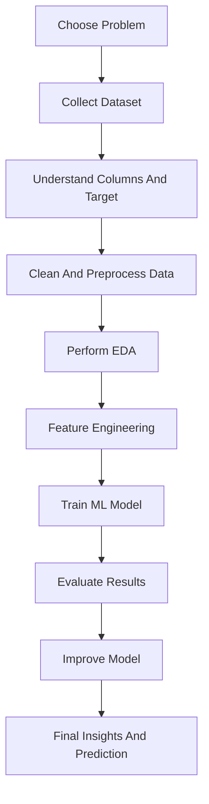
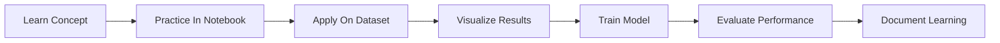
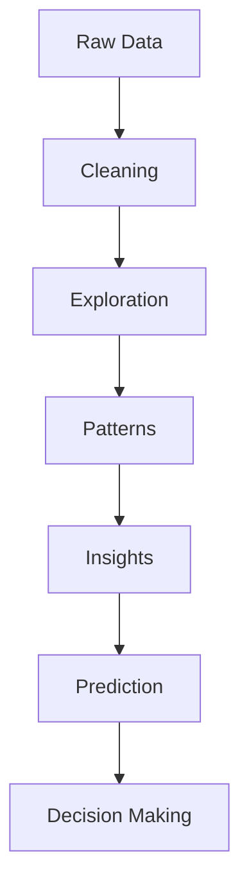

# Data Analytics Journey

<h1 align="center">Hi 🤙🏻, I'm Joshit</h1>

  Aspiring Data Analyst and Machine Learning enthusiast focused on turning raw data into useful insights, predictions, and better decisions.

  <a href="https://github.com/Joshit-innit/DataAnalystics_journey">Repository Link</a>

---

## 👨‍💻 Profile

I am currently building my journey in **Data Analytics**, **Machine Learning**, and **Python-based problem solving** by consistently working on real-world datasets and end-to-end analytical projects.

This repository represents more than just a collection of notebooks — it reflects my continuous learning process, practical experimentation, and growth as an aspiring Data Analyst and Machine Learning enthusiast.

Through these projects, I focus on understanding how raw data can be transformed into meaningful insights, predictive systems, and data-driven solutions. I enjoy exploring datasets, discovering hidden patterns, solving analytical problems, and improving model performance through hands-on implementation.

The projects in this repository cover multiple areas of analytics and machine learning, including:

- Exploratory Data Analysis (EDA)
- Data Cleaning and Preprocessing
- Feature Engineering
- Classification Problems
- Regression Models
- Clustering Techniques
- Predictive Analytics
- Healthcare Analytics
- Retail and Sales Forecasting
- Fraud Detection Systems
- Data Visualization and Insight Extraction

Each notebook follows a practical workflow that includes:
- understanding the dataset
- cleaning and transforming data
- visualizing important patterns
- building machine learning models
- evaluating results
- generating predictions and insights

This repository showcases my commitment to continuous improvement, project-based learning, and developing strong analytical thinking through real-world practice.

---

## 🎯 My Goal

My goal is to become a highly skilled **Data Analyst / Data Scientist** capable of solving real-world business and analytical problems using data-driven approaches.

I want to build strong expertise in understanding how raw data can be transformed into meaningful insights, predictions, and actionable solutions that help organizations and individuals make better decisions.

Through continuous learning and hands-on projects, I aim to strengthen my abilities in:

- understanding complex real-world datasets and business problems
- cleaning, preprocessing, and transforming messy data into usable formats
- performing exploratory data analysis to discover trends and hidden patterns
- creating clear and meaningful visualizations for storytelling and decision-making
- building machine learning models for prediction and classification tasks
- improving model accuracy through feature engineering and optimization
- interpreting analytical results and communicating insights in a simple and practical way
- developing complete end-to-end analytics workflows from raw data to final predictions

I am passionate about continuously improving my:
- analytical thinking
- problem-solving skills
- machine learning knowledge
- data visualization techniques
- project presentation skills

I believe data has the power to solve real-world problems, improve decision-making, and create meaningful impact. My long-term objective is to become a professional who can combine analytics, machine learning, and storytelling to build intelligent and practical solutions for businesses and society.

---

## Tech Stack And Libraries

  
  &nbsp;&nbsp;
  
  &nbsp;&nbsp;
  
  &nbsp;&nbsp;
  
  &nbsp;&nbsp;
  

### Libraries and Tools I've Used

- Python
- Pandas
- NumPy
- Matplotlib
- Scikit-learn
- Jupyter Notebook
- Data Visualization
- Exploratory Data Analysis
- Feature Engineering
- Machine Learning Models

---

## What I Have Learned So Far

### Data Analytics

- Data collection and dataset understanding
- Data cleaning and preprocessing
- Handling missing values
- Exploratory Data Analysis
- Pattern finding and insight extraction
- Data visualization for storytelling

### Machine Learning

- Supervised learning
- Classification models
- Regression models
- Model training and evaluation
- Feature engineering
- Prediction pipelines

### Project Skills

- Working with real datasets
- Notebook-based experimentation
- Comparing multiple approaches
- Organizing ML workflows from raw data to final result

---

## Projects In This Repository

| No. | Project Name | Area | File Link |
| --- | --- | --- | --- |
| 1 | Customer Segmentation KMeans | Clustering / Segmentation | [Open Notebook](./CustomerSegmentationKMeans.ipynb) |
| 2 | Insurance Machine Learning | Prediction / Regression | [Open Notebook](./InsuranceMachineLearning.ipynb) |
| 3 | Titanic Survival Machine Learning | Classification | [Open Notebook](./TitanicSurvivalMachineLearning.ipynb) |
| 4 | Fraud Detection Machine Learning | Fraud Detection / Classification | [Open Notebook](./frauddetectionmachinelearning.ipynb) |
| 5 | BigMart Sales Machine Learning | Sales Prediction | [Open Notebook](./projects/BigMartSalesMachineLearning.ipynb) |
| 6 | Heart Disease Analysis | Healthcare Analytics | [Open Notebook](./projects/HeartDiseaseAnalysis.ipynb) |
| 7 | Wine Testing | Classification / Analysis | [Open Notebook](./projects/WineTesting.ipynb) |
| 8 | Car Price Predictions | Regression | [Open Notebook](./projects/carPricePrdictions.ipynb) |
| 9 | Diabetes Detection | Healthcare / Classification | [Open Notebook](./projects/diabetiesDetection_EXP2.ipynb) |
| 10 | Gold Prediction | Prediction / Regression | [Open Notebook](./projects/gold_prediction.ipynb) |
| 11 | Rock vs Mine | Classification | [Open Notebook](./projects/rockVSmine_EXP1.ipynb) |

---

## Project Development Flow

---

## My Learning Workflow

---

## Data Analytics Mindset

---

## 🌟 Repository Highlights

This repository reflects my continuous growth and hands-on learning journey in the fields of Data Analytics and Machine Learning.

Through these projects, I have gained practical experience in:

- developing analytical thinking and problem-solving skills
- understanding how to work with real-world datasets
- performing data cleaning and preprocessing on messy data
- conducting exploratory data analysis (EDA) to uncover patterns and insights
- building machine learning models for prediction and classification tasks
- working on regression, classification, and clustering problems
- applying feature engineering techniques to improve model performance
- evaluating models using different performance metrics
- visualizing data clearly for better storytelling and interpretation
- organizing complete end-to-end machine learning workflows
- experimenting with different approaches and improving results through iteration
- strengthening confidence with Python libraries commonly used in data science and analytics

This repository also demonstrates my:
- consistency in learning
- curiosity for solving data-driven problems
- ability to apply theoretical concepts practically
- commitment to improving through project-based learning

Each notebook represents a step forward in my journey toward becoming a skilled Data Analyst and Machine Learning professional.

---

## Future Learning Goals

I plan to learn and improve further in:

- SQL for analytics
- Power BI / Tableau
- Advanced feature engineering
- Model optimization
- Deep learning basics
- Deployment of ML projects
- Better dashboards and storytelling

---

## Connect With My Work

If you want to explore my learning journey and projects, check the repository here:

[DataAnalystics_journey](https://github.com/Joshit-innit/DataAnalystics_journey)

---

  Great emperors are not built overnight, and neither are great empires. They are forged through patience, sacrifice, discipline, failure,    and years of relentless persistence.

